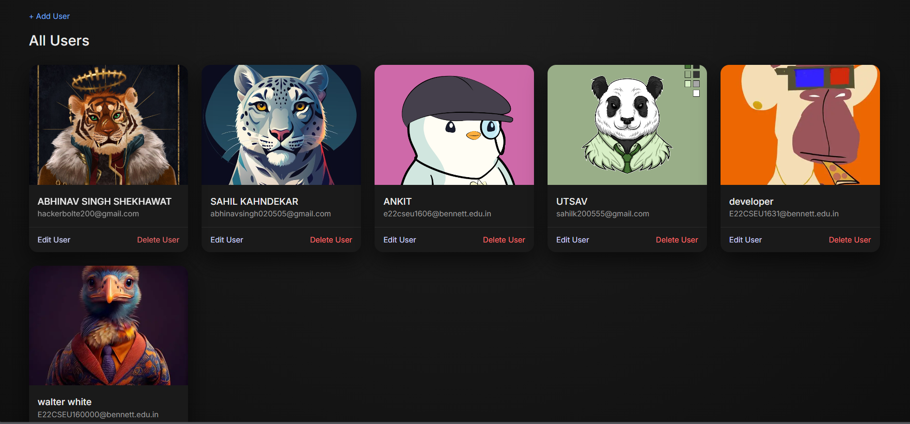

# User Management Dashboard

A **full‑stack User Management Dashboard** built with **Node.js, Express, MongoDB, and EJS**, featuring a clean UI and basic CRUD operations. This project demonstrates backend fundamentals, MVC structure, and secure environment configuration.

---

## 🚀 Features

* Create, read, update, and delete users
* Server‑side rendering with EJS
* MongoDB integration using Mongoose
* Clean project structure (routes, models, config)
* Environment variables support (`.env`)

---

## 🧰 Tech Stack

* **Backend:** Node.js, Express.js
* **Database:** MongoDB, Mongoose
* **Frontend:** EJS, CSS
* **Tools:** Git, GitHub, npm

---

## 📁 Project Structure

```
User-Management/
│── config/
│   └── database.js
│── models/
│   └── user.js
│── routes/
│   └── userRoutes.js
│── views/
│   ├── index.ejs
│   └── addUser.ejs
│── public/
│   └── style.css
│── .gitignore
│── .env.example
│── package.json
│── package-lock.json
│── server.js
```

---

## 🔐 Environment Variables

Create a `.env` file in the root directory and add:

```
PORT=5000
MONGO_URI=your_mongodb_connection_string
```

> ⚠️ **Never commit your `.env` file.** Use `.env.example` as a template.

---

## ▶️ Getting Started (Local Setup)

1. **Clone the repository**

```bash
git clone https://github.com/ABHINAVSINGHSHEKHAWAT/user-dashboard.git
cd user-dashboard
```

2. **Install dependencies**

```bash
npm install
```

3. **Add environment variables**

* Create `.env` using `.env.example` as reference

4. **Run the server**

```bash
npm start
```

5. Open in browser:

```
http://localhost:5000
```

---

## 📸 Screenshots


## 📸 Screenshots

### 🏠 Dashboard


### ➕ Add User Page


---

## 🌍 Deployment

You can deploy this project on platforms like:

* **Render**
* **Railway**
* **Vercel (backend as serverless)**

> Make sure to set environment variables in the deployment dashboard.

---

## 👨‍💻 Author

**Abhinav Singh Shekhawat**
Final‑year B.Tech (CSE) student | Full‑Stack Development

---

## ⭐ If you like this project

Give it a ⭐ on GitHub — it really helps!
